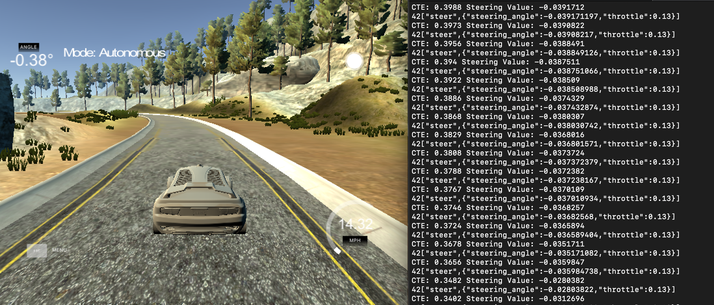

# CarND-Controls-PID
Self-Driving Car Engineer Nanodegree Program

---

## Solution Description


I tried a few methods to tune this controller.
My first attempt was to use the python simulator with the 'twiddle' algorithm to optimize the parameters. The parameters that were generated from the lesson created a system that overcorrected into a state of instability. Parameters like driving speed and max steering angle could be adjusted to better replicate the conditions in the simulator. I realized that, while twiddle reduces total error, the solution is likely not ideal as a passenger. It results in steep, underdamped oscillations that would be highly uncomfortable and unnecessary in most scenarios. From the previous trajectory generation project, it is likely that this path would void the curvature and jerk constraints. Ideally, we could set some constraints on the path during 'twiddle' to prefer overdamped paths that are smooth rather than underdamped paths that oscillate and are uncomfortable.


The other method I used to tune was simply by manual (not twiddle) trial and error. I followed steps described [here](https://robotics.stackexchange.com/questions/167/what-are-good-strategies-for-tuning-pid-loops) that instruct to first build a stable PD controller before introducing the integral component. During this process, I found that a minimum proportional value is needed to properly steer around the corners on the track at a given speed. If this value is too small, the vehicle doesn't correct enough and drives off the outside edge of the turn. If its too large, it oscillates once it enters the turn and eventually crashes. I found reducing the speed was helpful to maintain stability around tight corners (I reduced the set speed to 0.13). Although this is not ideal in a scenario where speed is prioritized, considering comfortable driving conditions is necessary in an autonomous vehicle carrying humans, and therefore it is natural to reduce speed in sharp corners. Ideally the trajectory would reduce speed on high curvature areas automatically. Once the PD controller was smooth and strong enough to corner at the set speed, I introduced a relatively small integral coefficient to correct for constant error. Too strong of an integral component and the vehicle will oscillate, but reducing this value provided just enough pull to bring the car back to the lane center.


## Dependencies

* cmake >= 3.5
 * All OSes: [click here for installation instructions](https://cmake.org/install/)
* make >= 4.1(mac, linux), 3.81(Windows)
  * Linux: make is installed by default on most Linux distros
  * Mac: [install Xcode command line tools to get make](https://developer.apple.com/xcode/features/)
  * Windows: [Click here for installation instructions](http://gnuwin32.sourceforge.net/packages/make.htm)
* gcc/g++ >= 5.4
  * Linux: gcc / g++ is installed by default on most Linux distros
  * Mac: same deal as make - [install Xcode command line tools]((https://developer.apple.com/xcode/features/)
  * Windows: recommend using [MinGW](http://www.mingw.org/)
* [uWebSockets](https://github.com/uWebSockets/uWebSockets)
  * Run either `./install-mac.sh` or `./install-ubuntu.sh`.
  * If you install from source, checkout to commit `e94b6e1`, i.e.
    ```
    git clone https://github.com/uWebSockets/uWebSockets
    cd uWebSockets
    git checkout e94b6e1
    ```
    Some function signatures have changed in v0.14.x. See [this PR](https://github.com/udacity/CarND-MPC-Project/pull/3) for more details.
* Simulator. You can download these from the [project intro page](https://github.com/udacity/self-driving-car-sim/releases) in the classroom.

Fellow students have put together a guide to Windows set-up for the project [here](https://s3-us-west-1.amazonaws.com/udacity-selfdrivingcar/files/Kidnapped_Vehicle_Windows_Setup.pdf) if the environment you have set up for the Sensor Fusion projects does not work for this project. There's also an experimental patch for windows in this [PR](https://github.com/udacity/CarND-PID-Control-Project/pull/3).

## Basic Build Instructions

1. Clone this repo.
2. Make a build directory: `mkdir build && cd build`
3. Compile: `cmake .. && make`
4. Run it: `./pid`.

Tips for setting up your environment can be found [here](https://classroom.udacity.com/nanodegrees/nd013/parts/40f38239-66b6-46ec-ae68-03afd8a601c8/modules/0949fca6-b379-42af-a919-ee50aa304e6a/lessons/f758c44c-5e40-4e01-93b5-1a82aa4e044f/concepts/23d376c7-0195-4276-bdf0-e02f1f3c665d)

## Editor Settings

We've purposefully kept editor configuration files out of this repo in order to
keep it as simple and environment agnostic as possible. However, we recommend
using the following settings:

* indent using spaces
* set tab width to 2 spaces (keeps the matrices in source code aligned)

## Code Style

Please (do your best to) stick to [Google's C++ style guide](https://google.github.io/styleguide/cppguide.html).

## Project Instructions and Rubric

Note: regardless of the changes you make, your project must be buildable using
cmake and make!

More information is only accessible by people who are already enrolled in Term 2
of CarND. If you are enrolled, see [the project page](https://classroom.udacity.com/nanodegrees/nd013/parts/40f38239-66b6-46ec-ae68-03afd8a601c8/modules/f1820894-8322-4bb3-81aa-b26b3c6dcbaf/lessons/e8235395-22dd-4b87-88e0-d108c5e5bbf4/concepts/6a4d8d42-6a04-4aa6-b284-1697c0fd6562)
for instructions and the project rubric.

## Hints!

* You don't have to follow this directory structure, but if you do, your work
  will span all of the .cpp files here. Keep an eye out for TODOs.
